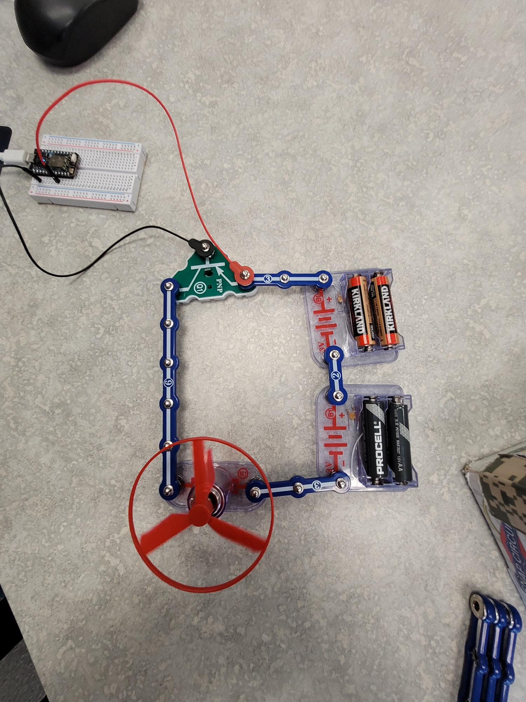

Video [a10-transistor](https://youtu.be/S6xwStw-t1U?list=PL57Dnr1H_egsL0r4RXPA4PY2yZhOJk5Nr&t=5s). Using a PNP transistor to protect the Photon while controlling a more powerful circuit, such as a small 3V DC motor. A kind of cheap single direction DC motor driver using only a transistor.

.

.
## Note: Image in video about the photon Transistors setup is slightly incorrect, Better images below:
Reminder you need to make your circuit diagram.

For PNP.jpg

.

.

For NPN.jpg

