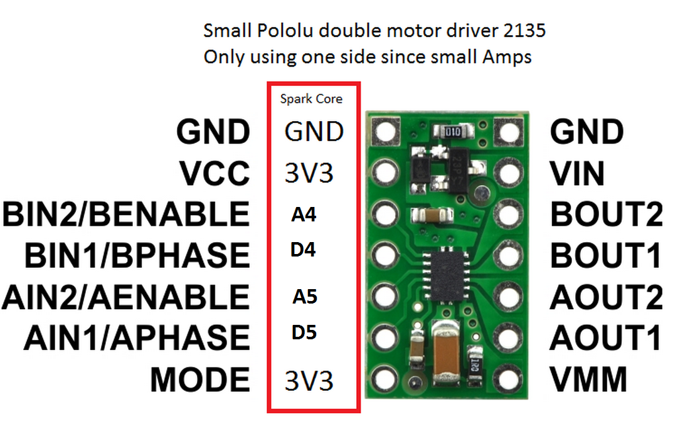

** A11 DC Motor Drivers

Now it is your turn to make two working cuircuit diagrams from the images below and to get them running using the Photon and the Web-app.

Good luck.

The dual motor driver can control two motors (you only have to get one working :>), the big motor driver can only control one motor but it can run a larger current and voltage. To prove that your motors work you can just use any 6V brushed DC motor. Sorry I don't have a good understanding yet of brushless motor drivers, but I will include a diagram when I can (The setup is easy it is the programming of the motor driver that seems confusing). 
