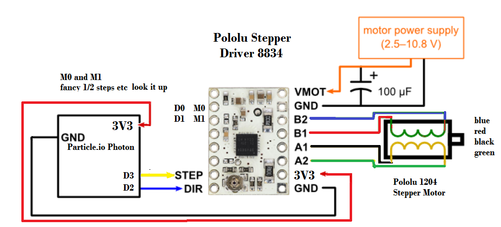

Connect the Pololu [stepper motor](https://www.pololu.com/product/1204) and [stepper driver](https://www.pololu.com/product/2134) as in the diagram

Video [a12-stepper-motor-driver](https://youtu.be/7wl20CeagmU?list=PL57Dnr1H_egsL0r4RXPA4PY2yZhOJk5Nr&t=5s) Just proving that a [Pololu stepper motor](https://www.pololu.com/product/1204) with [Pololu stepper driver](https://www.pololu.com/product/2134) works. You should try to program it to do more fancy things. Another thing my students tried is using delayMicroseconds() instead of delay() to get the stepper moving faster. As always be careful with your motor.

Check wires for your stepper. This is for the pololu 1204 stepper running with 6V

