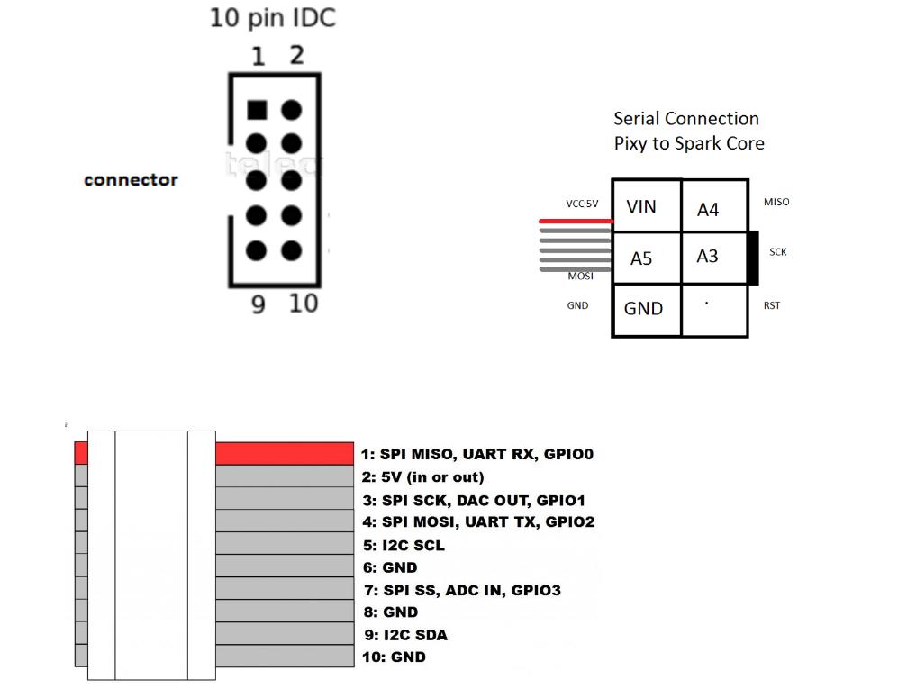
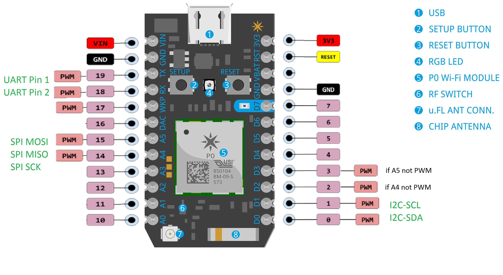

Load the .ino onto your particle.io IDE and then include header files (using the + on the top right of the IDE screen)  

make sure the capitalization is exact

Pixy.h

TPixy.h

no .cpp files needed for this project :>

Flash the code and make the connections to your pixy.

The pixy must be trained on a colour 

then read the particle.io console

Here is a reminder about the Photon pins

