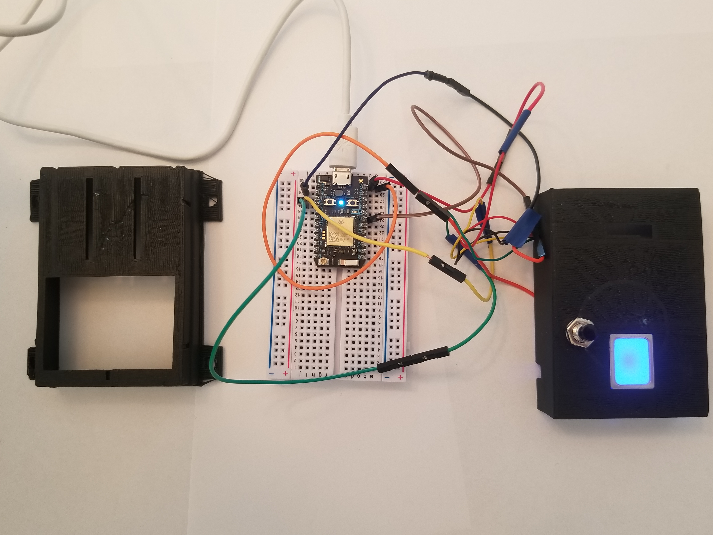

Before flashing the .ino file to your photon remember to go to the FPS library and include  .cpp and .h files into your project.

 

If you like the 3D printed case you can probably find it on my github 3D printing location at

[https://github.com/hpssjellis/my-3D-printing-stl](https://github.com/hpssjellis/my-3D-printing-stl)

Sorry, I don't save to [https://www.thingiverse.com/](https://www.thingiverse.com/) as most of my 3D prints are a work in progress.

I think you can purchase the FPS from [Sparkfun Fingerprint scanner https://www.sparkfun.com/products/13007](https://www.sparkfun.com/products/13007)

By Jeremy Ellis

Maker of www.rocksetta.com

Twitter
@rocksetta

Use at your own risk!

